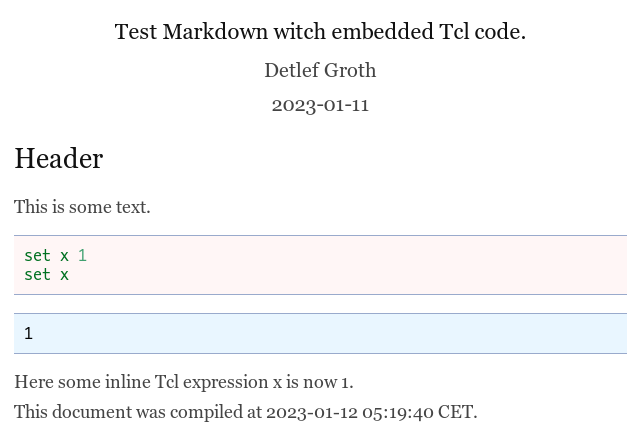

# Pantcl

Standalone Tcl application for document conversion with support for Tcl based
filters using the Pandoc document processor or Tcl only.

For a overview about the Pandoc Tcl filter you can see as well the presentation
at the presentation at [S
& T 2021](https://raw.githubusercontent.com/mittelmark/DGTcl/master/pandoc-tcl-filter/doc/Groth-S-and-T-2021.pdf).

The application `pantcl(.bin)` is a command line tool which can be used as a
standalone tool for document conversion from Markdown to HTML. In the Markdown
document as well code for programming languages like Tcl, Python, C++, Go or other tools like diagram
creation tools, image creation tools or for instance music note processors can be embedded.
For processing other input formats like ReStructuredText, Wiki Syntax, LaTeX it
can be used as well as a filter for the pandoc document processor. This way it
is as well possible to target other output format like docx, pdf and many
others. The tools contains as well a graphical user interface for direct
editing of code for graphical tools like GraphViz, PlantUml and many others.

So in summary pantcl allows you:

- document conversion from Markdown to HTNML with evaluation of internal code chunks without pandoc
- document conversion from many input (Markdown, ReStructuredText, Wiki formats, ...) 
  to many output formats (HTML, DOCX, PDF, ...) with evaluation of internal code chunks 
- writing code documentation inside source code using a `#'` prefix followed by
  Markdown code
- write filters for other graphical or programming tools using the Tcl programming language
- use a graphical interface to edit Markdown files with embedded code chunks
- use a graphical interface to edit diagram code with real time preview

# Processing schema


# Documentation

Here are links to the documentation:

* [pantcl.html](https://htmlpreview.github.io/?https://raw.githubusercontent.com/mittelmark/pantcl/master/pantcl.html) - main documentation
* [pantcl-tutorial.html](https://htmlpreview.github.io/?https://raw.githubusercontent.com/mittelmark/pantcl/master/pantcl-tutorial.html) - more extensive tutorial

<a name="filterlist" />
Filter documentation:

- [filter-abc](https://htmlpreview.github.io/?https://raw.githubusercontent.com/mittelmark/pantcl/master/lib/tclfilters/filter-abc.html) - visualize [ABC music notation](https://abcnotation.com/)
- [filter-cmd](https://htmlpreview.github.io/?https://raw.githubusercontent.com/mittelmark/pantcl/master/lib/tclfilters/filter-cmd.html) - execute shell scripts for instance [Lilypond music scripts](http://lilypond.org/), [GraphViz](https://www.graphviz.org) scripts, Python, Lua, R scripts, [sqlite3](https://www.sqlite.org) scripts, or code for languages like  C, C++, Go, Rust, V  etc.
- [filter-dot](https://htmlpreview.github.io/?https://raw.githubusercontent.com/mittelmark/pantcl/master/lib/tclfilters/filter-dot.html) - [GraphViz dot](https://www.graphviz.org) filter
- [filter-emf](https://htmlpreview.github.io/?https://raw.githubusercontent.com/mittelmark/pantcl/master/lib/tclfilters/filter-emf.html) - [Jasspa MicroEmacs macros](http://www.jasspa.com) filter
- [filter-eqn](https://htmlpreview.github.io/?https://raw.githubusercontent.com/mittelmark/pantcl/master/lib/tclfilters/filter-eqn.html) - visualize mathematical equations using eqn2graph, see here [Guide for typesetting using eqn](https://lists.gnu.org/archive/html/groff/2013-10/pdfTyBN2VWR1c.pdf)
- [filter-julia](https://htmlpreview.github.io/?https://raw.githubusercontent.com/mittelmark/pantcl/master/lib/tclfilters/filter-julia.html) - statistical language Julia (slow for embedding, use R instead) [Julia Website](https://julialang.org/)
- [filter-kroki](https://htmlpreview.github.io/?https://raw.githubusercontent.com/mittelmark/pantcl/master/lib/tclfilters/filter-kroki.html) - visualize diagram code using the [kroki webservice](https://kroki.io)
- [filter-mmd](https://htmlpreview.github.io/?https://raw.githubusercontent.com/mittelmark/pantcl/master/lib/tclfilters/filter-mmd.html) - visualize diagram code using the [mermaid command line tool](https://github.com/mermaidjs/mermaid.cli)
- [filter-mtex](https://htmlpreview.github.io/?https://raw.githubusercontent.com/mittelmark/pantcl/master/lib/tclfilters/filter-mtex.html) - visualize mathematical equations using LaTeX
- [filter-pic](https://htmlpreview.github.io/?https://raw.githubusercontent.com/mittelmark/pantcl/master/lib/tclfilters/filter-pic.html) - visualize diagram and flowcharts using the [PIC language](https://en.wikipedia.org/wiki/PIC_(markup_language))
- [filter-pik](https://htmlpreview.github.io/?https://raw.githubusercontent.com/mittelmark/pantcl/master/lib/tclfilters/filter-pik.html) - visualize diagram code or flowcharts uing [pikchr](https://fossil-scm.org/home/doc/trunk/www/pikchr.md) or [fossil](https://fossil-scm.org/home/doc/trunk/www/index.wiki)
- [filter-pipe](https://htmlpreview.github.io/?https://raw.githubusercontent.com/mittelmark/pantcl/master/lib/tclfilters/filter-pipe.html) - embed R, Python or Octave code or plots into Markdown
- [filter-puml](https://htmlpreview.github.io/?https://raw.githubusercontent.com/mittelmark/pantcl/master/lib/tclfilters/filter-puml.html) - embed [PlantUML](http://www.plantuml.com) code
- [filter-rplot](https://htmlpreview.github.io/?https://raw.githubusercontent.com/mittelmark/pantcl/master/lib/tclfilters/filter-rplot.html) - embed R plots
- [filter-sqlite](https://htmlpreview.github.io/?https://raw.githubusercontent.com/mittelmark/pantcl/master/lib/tclfilters/filter-sqlite.html) - embed [Sqlite3 SQL database](https://www.sqlite.org) statements
- [filter-tcl](https://htmlpreview.github.io/?https://raw.githubusercontent.com/mittelmark/pantcl/master/lib/tclfilters/filter-tcl.html) - embed Tcl statements
- [filter-tcrd](https://htmlpreview.github.io/?https://raw.githubusercontent.com/mittelmark/pantcl/master/lib/tclfilters/filter-tcrd.html) - embed Tcl music chords.
- [filter-tdot](https://htmlpreview.github.io/?https://raw.githubusercontent.com/mittelmark/pantcl/master/lib/tclfilters/filter-tdot.html) - embed Tcl GraphViz diaragrams
- [filter-tsvg](https://htmlpreview.github.io/?https://raw.githubusercontent.com/mittelmark/pantcl/master/lib/tclfilters/filter-tsvg.html) - embed Tcl created SVG code

External filter(s):

- [user-filter](https://htmlpreview.github.io/?https://raw.githubusercontent.com/mittelmark/pantcl/master/user/user-filter.html) - documentation on how to create and use a filter not embedded directly within the pantcl executable
- [filter-geasy](https://htmlpreview.github.io/?https://raw.githubusercontent.com/mittelmark/pantcl/master/user/filter-geasy.html) - example for an external user defined filter not embedded directly within the pantcl executable

# Installation

Please note, that you must have a tclsh executable in your PATH to use this
tool. On Ubuntu systems you can install Tcl using your package managers like
this: `sudo apt install Tcl`. If you have a `tclsh` executable in your `PATH`
you then download the latest build from the Github page here: 

[https://github.com/mittelmark/pantcl/files/11603113/pantcl.bin.gz](https://github.com/mittelmark/pantcl/files/11603113/pantcl.bin.gz)

Unpack the Gzip file and make the file pantcl.bin executable using chmod. You can as rename
it for instance to just `pantcl`. Then move it to a folder within belonging to your `PATH` variable. For instance "~./bin" or "~/.local/bin".

Before you continue check if you executable is working by writing in the
terminal something like this:

```
$ pantcl --version
0.9.12
$ pandoc --version
pandoc 2.14.2
...
```

For Windows you should download the standalone executable which contains a Tcl
library and all required libraries and files within.
[https://github.com/mittelmark/pantcl/releases/download/0.9.11/pantcl.exe](https://github.com/mittelmark/pantcl/releases/download/0.9.11/pantcl.exe).
Just dowload the file to your harddisk and place it somewhere in your PATH. The
in a terminal window, Powershell, Cmd, etc. type `pantcl --version` if this
works you should be able to use it a Pandoc filter.

Without an installed pandoc executable only conversion from Markdown to HTML
can be performed.

The file `pantcl.bin` contains embedded all the filters mentioned above. You can try out the installation by creating a simple Markdown file with some embedded Tcl code like this:

```
    ---
    title: Test Markdown witch embedded Tcl code.
    author: Detlef Groth
    date: 2023-01-11
    tcl:
       eval: 1
    ---

    ## Header

    This is some text.

    ```{.tcl eval=true}
    set x 1
    set x
    ```

    Here some inline Tcl expression x is now `tcl set x`. 

    This document was compiled at 
    `tcl clock format [clock seconds] -format "%Y-%m-%d %H:%M:%S"` CET.
```

Save this code in a file `test.md` removing the leading whitespaces and try to convert the file using the command line:

```
pantcl.bin test.md test.html -s
```

The output `test.html` should then look like this:




If this works you can continue and try to use other code filters from the list shown [above](#filterlist).

Please note, that since version 0.9.2 the filter evaluation is per default set
to false to avoid interpretation just by accident. You must enable filter
evaluation either on individual code chunks by setting `eval=true` as the code
chunk option as shown above or if you like to have it globally enabbled by
writing it in the YAML header of a Markdown document like this:

```
---
title: xyz
author: nn
date: 2023-03-11
tcl:
    eval: 1
dot:
    eval: 1
---
```

Which would enable code evaluation for Tcl and graphics generation for every
GraphViz dot code chunk. 

## Rst files

If your input document does not support YAML headers
you can provide a YAML configuration in an external file, an example can be seen
in the file [tests/sample.yaml](tests/sample.yaml). You then provide the required
argument for the pandoc document converter in the command line like this:

```
pandoc sample.rst --filter pantcl -o sample-rst.html -s \
		--metadata-file sample.yaml
```

How to define chunk options in Rst files can be seen here in the file
[tests/sample.rst](https://raw.githubusercontent.com/mittelmark/pantcl/main/tests/sample.rst).

Here an example for an inserted GraphViz dot code chunk in such an Rst file:

```
.. code-block:: dot
   :caption: GraphViz dot example
   :eval: true

   digraph g {
      A -> B ;
   }

```

To create a PDF file you could use a command line like this:

```
pandoc sample.rst --filter pantcl.tcl -o sample-rst.pdf \
    --metadata documentclass=scrartcl --metadata-file sample.yaml
```

Here the resulting output file 
[sample-rst.pdf](https://github.com/mittelmark/pantcl/files/10951380/sample-rst.pdf).

## LaTeX files

There is as well support for LaTeX as input file format. You just must use the
`Verbatim` (uppercase V) environment together with the chunk options in
brackets. The filtertype will be declared giving the filter option. Here an
example for a dot filter in your LaTeX code:

```
\begin{Verbatim}[filter=dot,eval=true]
digraph g {
  rankdir="LR";
  node[style=filled,fillcolor=skyblue,shape=box];
  A -> B
}
\end{Verbatim}
```

If you like to hide the source code just specify `echo=false` as an additional
code chunk option. Here an example input file [tests/sample.tex](https://raw.githubusercontent.com/mittelmark/pantcl/main/tests/sample.tex)
and here the output
[sample-tex.pdf](https://github.com/mittelmark/pantcl/files/10953559/sample-tex.pdf).

The pdf document can be created with the following command line:

```
pandoc sample.tex --filter pantcl -o sample-tex.pdf \
	 --metadata documentclass=scrartcl
```

## GUI application

You can as well run a graphical user interace to edit separate diagram code
files or to edit several code chunks in a Markdown document. Just call pantcl
with a option `--gui` like this:

```
pantcl --gui test.md
```

Here you see a running session where you can go with your cursor into the
different code chunks and if you press Ctrl-s for file saving the current code
chunk is evaluated and the output is visible in the image window on top:


## LICENSE

BSD 2-Clause License

Copyright (c) 2023, Detlef Groth

Redistribution and use in source and binary forms, with or without
modification, are permitted provided that the following conditions are met:

1. Redistributions of source code must retain the above copyright notice, this
   list of conditions and the following disclaimer.

2. Redistributions in binary form must reproduce the above copyright notice,
   this list of conditions and the following disclaimer in the documentation
   and/or other materials provided with the distribution.

THIS SOFTWARE IS PROVIDED BY THE COPYRIGHT HOLDERS AND CONTRIBUTORS "AS IS"
AND ANY EXPRESS OR IMPLIED WARRANTIES, INCLUDING, BUT NOT LIMITED TO, THE
IMPLIED WARRANTIES OF MERCHANTABILITY AND FITNESS FOR A PARTICULAR PURPOSE ARE
DISCLAIMED. IN NO EVENT SHALL THE COPYRIGHT HOLDER OR CONTRIBUTORS BE LIABLE
FOR ANY DIRECT, INDIRECT, INCIDENTAL, SPECIAL, EXEMPLARY, OR CONSEQUENTIAL
DAMAGES (INCLUDING, BUT NOT LIMITED TO, PROCUREMENT OF SUBSTITUTE GOODS OR
SERVICES; LOSS OF USE, DATA, OR PROFITS; OR BUSINESS INTERRUPTION) HOWEVER
CAUSED AND ON ANY THEORY OF LIABILITY, WHETHER IN CONTRACT, STRICT LIABILITY,
OR TORT (INCLUDING NEGLIGENCE OR OTHERWISE) ARISING IN ANY WAY OUT OF THE USE
OF THIS SOFTWARE, EVEN IF ADVISED OF THE POSSIBILITY OF SUCH DAMAGE.
